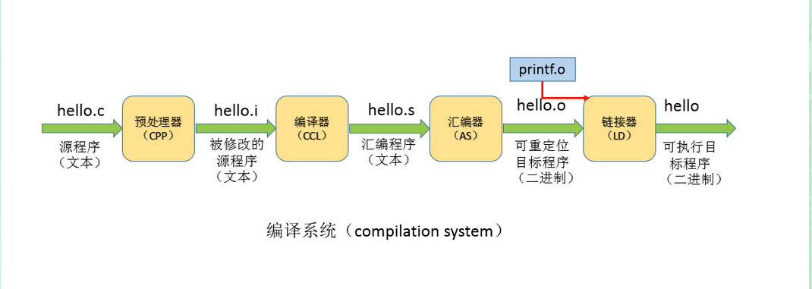

[TOC]

# 实验环境

这篇文章介绍 ELF 文件编译链接的过程和原理，所有的结论都是通过查阅资料和实验得到的，如果有错误之处欢迎指教。

所有的实验在 Fedora 32（5.8.12-200.fc32.x86_64）上使用 GCC 10.2.1 完成。

使用以下源代码作为文章的例子。sum.c 是库文件，定义了函数`sum()`， use_sum.c 中的`main()`会调用该函数。两个文件中的`test()`不做任何操作，仅仅是为了说明动态链接时的符号解析问题。sum.c 中的`__attribute__((visibility("default")))`是为了说明符号的可见性，可以暂时认为该属性对程序没有任何影响。

```C
// use_sum.c
#include <stdio.h>
extern int counter;
int sum(int, int);

void test()
{
    printf("in executable function test\n");
}    


int 
main()
{
    int a = 100, b = 200;
    printf("-------------------------\n");
    printf("in use_sum.c\n");
    printf("-------------------------\n");
    printf("addres of sum: %p\n", sum);
    printf("address of test: %p\n", test);
    printf("address of counter: %p\n", &counter);
    sum(a, b);
    return 0;
}
```

```C
// sum.c
#include <stdio.h>
__attribute__((visibility("default"))) int counter;

__attribute__((visibility("default"))) void test()
// void test()
{
    printf("In libsum.so test function\n");
}

__attribute__((visibility("default"))) int
sum(int a, int b)
{
    printf("---------------\n");
    printf("in libsum.so\n");
    printf("---------------\n");
    printf("address of sum: %p\n", sum);
    printf("address of test: %p\n", test);
    printf("address of counter: %p\n", &counter);
    ++counter;
    return a + b;
}

```


# 什么是编译链接

现代软件开发方法都使用_分离式编译_，即一个项目由多个源文件组成，分别编译源文件并将它们链接为可执行文件或动态库。本文中的编译链接只涉及 C 源文件的编译链接，实际项目中很可能涉及多语言源文件的编译链接，比如 C 和 C++ 共存。

_编译_狭义上指将*编译单元*（一个源文件）转化为汇编文件的过程，广义上指整个预处理、编译、汇编、链接的过程。汇编是将汇编文件转化为可重定位文件的过程，这个过程会生成重定位条目和符号表供链接器使用。链接阶段链接器将所有的重定位文件整合为一个可执行文件或动态库。

通常我们说的编译器中的“编译”一词指广义的编译，编译器实际上一个编译系统，包含了预处理器、编译器、汇编器、链接器。本文中即会直接使用编译系统 GCC，会单独使用汇编器、链接器等工具。

GCC 编译系统中，一个源文件的编译过程如下：



链接分为静态链接和动态链接。静态链接将多个重定位文件聚合为一个可执行文件或动态库。动态链接将多个重定位文件和动态库的重定位信息聚合为一个部分链接的可执行文件，在加载、运行后再进行链接，使其成为完全链接的可执行文件。

编译、链接涉及三类文件：

- 可重定位对象文件（relocated object file）：编译的产物，是生成可执行文件和动态库的原料。
- 动态库 （shared library）：部分链接的文件，给可执行文件提供代码、数据。也叫共享库，动态链接库（DLL），动态共享对象（DSO）等。
- 可执行文件（executable）：可以执行的文件。

动态库虽然也叫动态共享对象，但是要和课重定位对象文件区分开，它是编译链接后的产物，是生成的产品，和可执行文件性质相同。

链接主要做两件事情

- 符号解析：将符号的引用和符号的定义关联起来。
- 重定位：将符号引用的地址修改为符号定义的地址。


# 静态链接

# 动态链接

## 位置无关代码

## PLT 和 GOT

## 外部变量的解析

## 外部函数的解析

# 符号的可见性


# -no-plt

# 可执行文件中的 .bss 节


`-fpic`  `-fpie`

`-shared` `-static`


- 无法进行静态链接，ld 报错`无法找到 -lc`。

这是因为系统缺少了静态链接的 C 标准库。在我的 Fedora 32 系统中，默认已经不再安装静态库，查找 /usr 只能查找到 libc_nonshared.a，这个库是给 libc.so 使用的，不能作为真正的 libc.a 使用。只需要安装`glibc-static`包即可。


参考 stackoverflow 问题	

