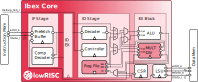

# Ibex 是什么？

> Ibex was initially developed as part of the [PULP platform](https://www.pulp-platform.org) under the name ["Zero-riscy"](https://doi.org/10.1109/PATMOS.2017.8106976), and has been contributed to [lowRISC](https://www.lowrisc.org) who maintains it and develops it further. It is under active development.

Ibex 是一个产品级的 32 位开源 RISC-V 处理器，使用 SystemVerilog 编写，麻雀虽小（11000 行左右），五章俱全。支持 RV32I、RV32C、RV32M、RV32B 等拓展，支持了 M-Mode 和 U-Mode，完整实现了 RISC-V 指令集规定的控制状态寄存器、中断异常、调试支持等，适用于嵌入式系统。

总体架构如下：

# 流水线

Ibex 默认使用两级流水线，但也支持三级流水线（实验性特性）。两级流水分别为：

- 取值（IF）：通过预取缓冲区（prefetch buffer）从内存中取值，可以一个周期取一条指令，只要指令侧内存支持。
- 译码/执行（ID/EX）：译码并立即执行，所有的操作，包括寄存器读写、内存访问都在该阶段进行。

Ibex 支持多周期指令，每条指令都至少需要两个周期才能通过流水线，周期数更大的指令将导致流水线停顿多个周期。指令类型及其停顿周期如下：

| Instruction Type      | Stall Cycles                                                 | Description                                                  |
| --------------------- | ------------------------------------------------------------ | ------------------------------------------------------------ |
| Integer Computational | 0                                                            | Integer Computational Instructions are defined in the RISCV-V RV32I Base Integer Instruction Set. |
| CSR Access            | 0                                                            | CSR Access Instruction are defined in ‘Zicsr’ of the RISC-V specification. |
| Load/Store            | 1 - N                                                        | Both loads and stores stall for at least one cycle to await a response.  For loads this response is the load data (which is written directly to the register file the same cycle it is received).  For stores this is whether an error was seen or not.  The longer the data side memory interface takes to receive a response the longer loads and stores will stall. |
| Multiplication        | 0/1 (Single-Cycle Multiplier) 2/3 (Fast Multi-Cycle Multiplier) clog2(`op_b`)/32 (Slow Multi-Cycle Multiplier) | 0 for MUL, 1 for MULH. 2 for MUL, 3 for MULH. clog2(`op_b`) for MUL, 32 for MULH. See details in [Multiplier/Divider Block (MULT/DIV)](https://ibex-core.readthedocs.io/en/latest/03_reference/instruction_decode_execute.html#mult-div). |
| Division Remainder    | 1 or 37                                                      | 1 stall cycle if divide by 0, otherwise full long division. See details in [Multiplier/Divider Block (MULT/DIV)](https://ibex-core.readthedocs.io/en/latest/03_reference/instruction_decode_execute.html#mult-div) |
| Jump                  | 1 - N                                                        | Minimum one cycle stall to flush the prefetch counter and begin fetching from the new Program Counter (PC).  The new PC request will appear on the instruction-side memory interface the same cycle the jump instruction enters ID/EX. The longer the instruction-side memory interface takes to receive data the longer the jump will stall. |
| Branch (Not-Taken)    | 0                                                            | Any branch where the condition is not met will not stall.    |
| Branch (Taken)        | 2 - N 1 - N (Branch Target ALU enabled)                      | Any branch where the condition is met will stall for 2 cycles as in the first cycle the branch is in ID/EX the ALU is used to calculate the branch condition.  The following cycle the ALU is used again to calculate the branch target where it proceeds as Jump does above (Flush IF stage and prefetch buffer, new PC on instruction-side memory interface the same cycle it is calculated).  The longer the instruction-side memory interface takes to receive data the longer the branch will stall. With the parameter `BranchTargetALU` set to `1` a separate ALU calculates the branch target simultaneously to calculating the branch condition with the main ALU so 1 less stall cycle is required. |
| Instruction Fence     | 1 - N                                                        | The FENCE.I instruction as defined in ‘Zifencei’ of the RISC-V specification. Internally it is implemented as a jump (which does the required flushing) so it has the same stall characteristics (see above). |

# 取指（IF）

Ibex 通过预取缓冲区（prefetch buffer）从内存中取值，对指令高速缓存处于草案阶段，需要专门配置。Ibex 的预取缓冲区线性地取指令知道缓冲区满，指令连同对应的 PC 一起存储到取指队列中。当执行跳转指令时，IF 阶段的控制区刷新预取缓冲区。

Ibex 支持 RV32C（压缩指令拓展），在 IF 阶段解压压缩指令，使得 ID/EX 不需要针对压缩指令专门设计。

分支预测策略也是可配置的，`BranchPrediction`设置为`1`，则假设跳向负偏移的地址的指令总是成功，默认的策略还不清楚。

在外部，IF 接口（指令侧内存接口）仅执行字对齐的指令提取。 未对齐的指令提取通过执行两个单独的字对齐的指令提取来处理。 在内部，内核可以处理字对齐和半字对齐的指令地址，以支持压缩指令。 指令地址的LSB在内部被忽略。

## 译码/执行（ID/EX）

ID/EX 阶段由多个块组成：

- Instruction Decode Block：控制 ID/EX 的总体执行过程
- Decoder：负责具体的解码和信号发送
- Controller：维护处理器的有限状态机，尤其在跳转发生时设置 PC，处理异常/中断
- Registers:：寄存器组，本处理器没有在寄存器组中实现前递
- EX Block：主要是实例化 ALu 和乘法器/除法器
- ALU：实现 RV32I 中的算术逻辑运算，为乘除法器提供支持，也负责跳转目标地址的计算
- Multiplier/Divider Block(MULT/DIV)：实现 RV32M 拓展
- CSR：控制状态寄存器，其中包含异常/中断处理相关的寄存器、性能计数器、调试寄存器等
- LSU：存储/加载单元，负责读写内存

# 加载-存储单元（Load-Store Unit）

Ibex 是 32 位 RISC-V 处理器，自然可以存取字、半字、字节，任何加载-存储操作都间感到值流水线停顿至少一个周期。Ibex 支持未对齐的内存访问，一次未对齐的内存访问将导致两次对齐的内存访问，LSU 负责合并两次访问。不论访问是否成功，未对齐的内存访问都导致两次对齐的内存访问，如果第一次对齐的内存访问失败，LSU 仍会接收到内存发送的数据，LSU 会将它忽略，从而保证行为的正确性。

LSU 负责处理器和内存间的交互（存取内存），最重要的地方在于 LSU 使用的协议。LSU 接口如下：

| Signal               | Direction | Description                                                  |
| -------------------- | --------- | ------------------------------------------------------------ |
| `data_req_o`         | output    | Request valid, must stay high until `data_gnt_i` is high for one cycle |
| `data_addr_o[31:0]`  | output    | Address, word aligned                                        |
| `data_we_o`          | output    | Write Enable, high for writes, low for reads. Sent together with `data_req_o` |
| `data_be_o[3:0]`     | output    | Byte Enable. Is set for the bytes to write/read, sent together with `data_req_o` |
| `data_wdata_o[31:0]` | output    | Data to be written to memory, sent together with `data_req_o` |
| `data_gnt_i`         | input     | The other side accepted the request. Outputs may change in the next cycle. |
| `data_rvalid_i`      | input     | `data_err_i` and `data_rdata_i` hold valid data when `data_rvalid_i` is high. This signal will be high for exactly one cycle per request. |
| `data_err_i`         | input     | Error response from the bus or the memory: request cannot be handled. High in case of an error. |
| `data_rdata_i[31:0]` | input     | Data read from memory                                        |

1. LSU 读取内存时向内存发送 32 比特字对齐的地址`data_addr_o`和请求标志`data_req_o`（整个周期，知道接收到`data_gnt_i`），写时还要发送 32 比特数据`data_wdata_o`和 Byte Enable 标志`data_be_o`。内存接收到信号和数据后返回`data_gnt_i`，告知 LSU 请求已接收并将处理。内存立刻应答但很可能在多个周期后才服务请求（内存访问速度较慢）。
2. LSU 接收到内存应答`data_req_o`后就可以发送下一次请求了，内存会记录上次接收到的请求，不会丢失。
3. 如果内存在服务请求后， LSU 发送`data_rvalid_i`信号（一整个周期），LSU 通过观察`data_err_i`判断内存是否正确服务请求并接收/忽略`data_rdata_i`。`data_gnt_i`告知 LSU 内存已收到请求，`data_rvalid_i`告知 LSU 内存已服务请求。
4. 同一时刻可能存在多个已发送未服务的请求，协议认为所有的内存请求都是顺序的（不存在乱序），并且内存会为每一个已服务的请求返回`data_rvalid_i`。

# 寄存器组

Ibex 支持 32 个通用寄存器（RV32I）或 15 个 通用寄存器（RV32E）。寄存器堆具有两个读取端口和一个写入端口，寄存器堆数据在请求读取的同一周期内可用。 没有写入读取的前递路径，因此，如果同时读取和写入一个寄存器，则读取将返回当前值，而不是正在写入的值。

Ibex 的实现了三个版本的寄存器堆：

- 基于触发器的版本：使用 **Verilator** 首选
- 基于锁存器的版本：使用 **ASCI 实现**首选
- 基于 FPGA 的版本：使用 **FPGA** 首选

## 中断/异常，性能计数器，状态控制寄存器，调试支持，物理内存保护（PMP）

Ibex 支持 RISV-V 指令集规范规定的全部以上特性。